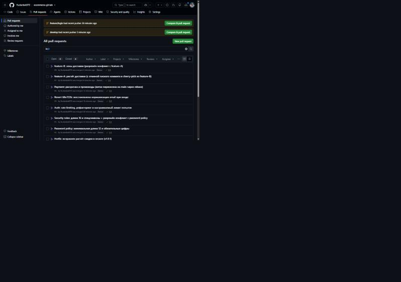
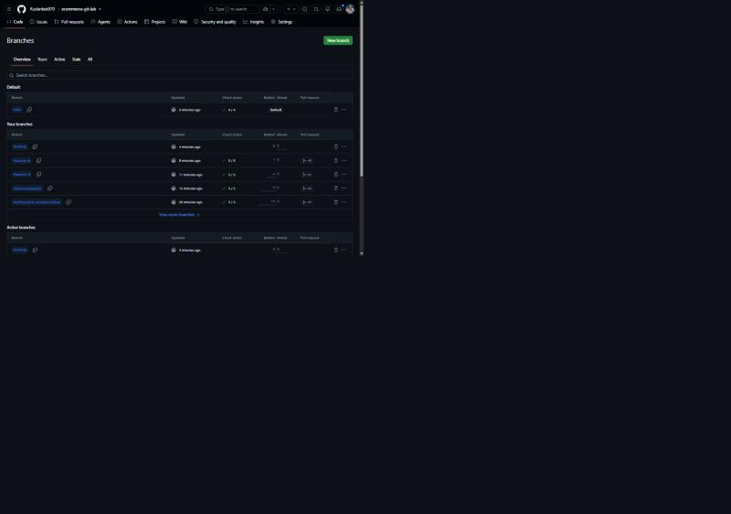
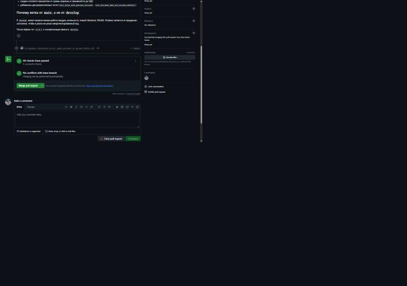
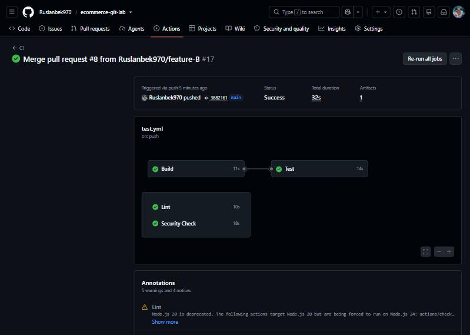
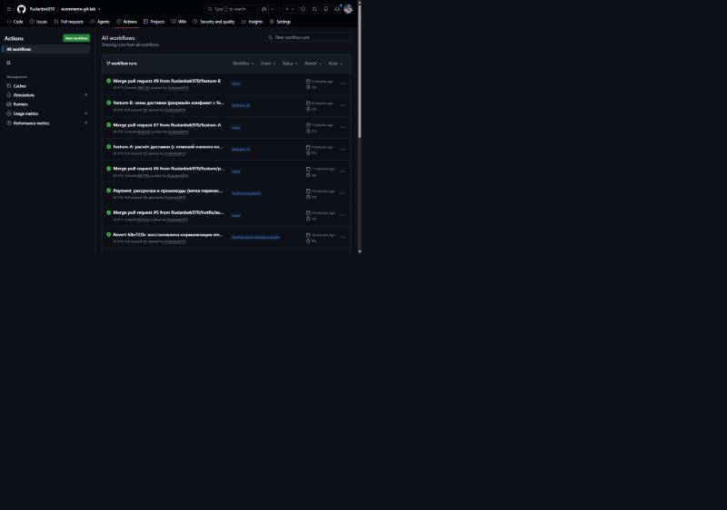
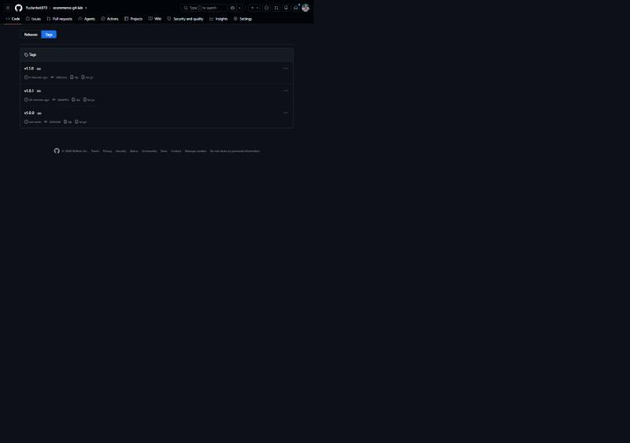
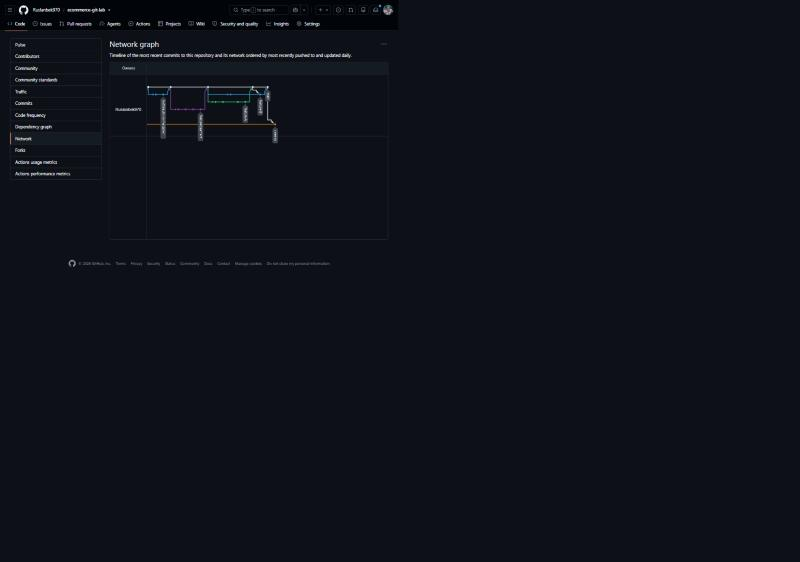

# Отчёт по лабораторной: Advanced Git & GitHub (вариант A)

Репозиторий: https://github.com/Ruslanbek970/ecommerce-git-lab
Проект: учебный интернет-магазин ShopKZ — корзина, оплата, авторизация, доставка.

Все пять заданий и финальный челлендж сделаны в одном репозитории. Каждое изменение
попадало в `main` через Pull Request, на каждый PR прогонялся GitHub Actions.

| Что | Где смотреть |
|---|---|
| Pull Request'ы | [все 8 PR](https://github.com/Ruslanbek970/ecommerce-git-lab/pulls?q=is%3Apr) |
| Ветки | [branches](https://github.com/Ruslanbek970/ecommerce-git-lab/branches) |
| Теги | [tags](https://github.com/Ruslanbek970/ecommerce-git-lab/tags): `v1.0.0`, `v1.0.1`, `v1.1.0` |
| Запуски CI | [Actions](https://github.com/Ruslanbek970/ecommerce-git-lab/actions) |
| Граф истории | [network](https://github.com/Ruslanbek970/ecommerce-git-lab/network) |
| Полные логи команд | `docs/transcripts/*.txt` — вывод терминала целиком, без сокращений |



## Структура репозитория

```
src/        payment.py, auth.py, shipping.py, loyalty.py, checkout.py, oauth.py
tests/      24 теста на pytest
config/     security.conf — политика паролей
.github/workflows/test.yml   CI: Build → Test, Lint, Security Check
docs/
  screenshots/   скриншоты GitHub
  transcripts/   логи всех git-команд
  check_auth.py  тест для git bisect
REPORT.md
```

Ветки: `main` — продакшн, `develop` — интеграционная, `feature/*` — задачи,
`hotfix/*` — срочные правки от `main`.



---

## Задание 1. Хотфикс оплаты в продакшне

**Что было сломано.** В `calculate_total()` скидка вычиталась как абсолютная сумма:

```python
total = subtotal * (1 + TAX_RATE)
total = total - discount_percent     # 10 вместо 10%
```

Заказ на 10 000 ₸ со скидкой 10% считался как 11 190 ₸ вместо 10 080 ₸ — почти
на 1 110 ₸ дороже на каждом заказе со скидкой.

**Команды** (полный лог — `docs/transcripts/task1-hotfix.txt` и `task1-hotfix-part2.txt`):

```bash
git checkout main
git checkout -b hotfix/payment-bug
# правка src/payment.py + два регрессионных теста
git add .
git commit -m "Fix payment calculation error: apply discount as percent before VAT"
git push origin hotfix/payment-bug
# PR #1 → main → merge
git checkout main && git pull origin main
git tag -a v1.0.1 -m "Hotfix release v1.0.1"
git push origin v1.0.1
git checkout develop && git merge main
git push origin develop
```

Исправленный расчёт:

```python
discounted = subtotal * (1 - discount_percent / 100)
total = discounted * (1 + TAX_RATE)
```

Проверка до и после фикса:

```
корзина: 10 000 ₸, скидка 10%, НДС 12%
ожидаемая сумма        : 10080.0
до фикса (ветка main)  : 11190.0
после фикса (hotfix)   : 10080.0
```

PR #1 с зелёным CI — пять проверок прошло, конфликтов с base-веткой нет:



### Почему ветка хотфикса создаётся от `main`, а не от `develop`

В `develop` на момент аварии лежало три коммита незаконченной работы: модуль
лояльности, где `tier_for_customer()` просто бросает `NotImplementedError`, новый
checkout за фича-флагом и кусок OAuth. Если создать `hotfix/payment-bug` от
`develop`, в пулл-реквест в `main` попадёт не одна правка расчёта, а всё это разом.
Продакшн получит код, который никто не тестировал и который команда сама считает
недоделанным.

Второй довод — размер диффа. PR от `main` — два файла и 13 строк, его читают за
минуту. PR от `develop` содержал бы ещё четыре коммита и пять файлов, и ревьюер в
ночь аварии разбирался бы не с багом оплаты, а с чужими TODO.

Третий довод — откат. Хотфикс от `main` — это один коммит поверх известного
состояния продакшна, он откатывается одним `git revert`. Если в хотфиксе приедет
половина `develop`, откатывать придётся по кускам в тот момент, когда и так всё горит.

Чтобы фикс не потерялся в следующем релизе, после мёржа в `main` он отдельным
мёржем уехал в `develop` — это видно в графе: `6e74cba Merge hotfix v1.0.1 from main into develop`.

---

## Задание 2. Конфликт в политике паролей

Два разработчика правили один и тот же файл `config/security.conf`:

| | Dev A (`feature/password-policy`) | Dev B (`feature/security-rules`) |
|---|---|---|
| длина пароля | 12 | 16 |
| цифры | обязательны | — |
| спецсимволы | — | обязательны |

Сначала влили PR #2 (Dev A). После этого ветка Dev B отстала от `main`, и
`git merge main` дал конфликт (лог целиком — `docs/transcripts/task2-merge-conflict.txt`):

```
$ git merge main
Auto-merging config/security.conf
CONFLICT (content): Merge conflict in config/security.conf
Automatic merge failed; fix conflicts and then commit the result.

$ git status --short
UU config/security.conf

$ cat config/security.conf
[password_policy]
<<<<<<< HEAD
minimum_password_length = 16
require_uppercase = false
require_symbols = true
=======
minimum_password_length = 12
require_uppercase = false
require_numbers = true
>>>>>>> main
max_login_attempts = 5
```

**Как разрешили:**

```ini
[password_policy]
minimum_password_length = 16
require_uppercase = false
require_numbers = true
require_symbols = true
max_login_attempts = 5
```

Требования про цифры и спецсимволы друг другу не мешают, поэтому в конфиге остались
оба. С длиной иначе: два значения взаимоисключающие, и выбрали большее. 16 символов
удовлетворяет и политике Dev A (`>= 12`), а 12 нарушило бы политику Dev B. Тесты обеих
веток после этого проходят: `test_minimum_length_is_at_least_12` и
`test_minimum_length_is_16` одновременно зелёные.

Разрешение лежит в коммите `99eec8a`, в его теле записано обоснование выбора.
Дальше ветка уехала в `main` через PR #3.

---

## Задание 3. Поиск плохого коммита через bisect

**Симптом.** Поддержка пишет: часть пользователей не может войти. Воспроизводится,
если ввести почту с заглавными буквами или с пробелом — `Aisha@Shop.KZ` не пускает,
`aisha@shop.kz` пускает.

Тестов, которые бы это ловили, не было: во всех тестах email в нижнем регистре,
поэтому CI на всех коммитах был зелёный. Руками перебирать историю долго — восемь
коммитов после последнего заведомо рабочего релиза.

**Тест для bisect** (`docs/check_auth.py`, лежит вне истории, чтобы запускаться на
любом коммите): пробует войти тремя вариантами одного email, возвращает 0 или 1.

```bash
git bisect start
git bisect bad                       # текущий main сломан
git bisect good v1.0.1               # на теге релиза всё работало
git bisect run python3 $HOME/check_auth.py
```

Три шага, и git сам назвал виновника (полный лог — `docs/transcripts/task3-bisect.txt`):

```
Bisecting: 4 revisions left to test after this (roughly 2 steps)   → GOOD
Bisecting: 2 revisions left to test after this (roughly 1 step)    → BAD
Bisecting: 0 revisions left to test after this (roughly 0 steps)   → GOOD
68e722b730107b57e3f5825b5d5bcb53a807d16e is the first bad commit
```

### Карточка плохого коммита

| | |
|---|---|
| **Bad commit** | `68e722b` — Refactor authenticate(): extract find_user() helper |
| **Author** | Junior Dev `<junior@shop.kz>` |
| **Date** | 2026-09-29 14:05 +0500 |
| **Changed files** | `src/auth.py` (+7 −3) |
| **Problem** | При выносе поиска пользователя в `find_user()` потерялся вызов `normalize_email()`. Поиск пошёл по сырой строке, и всё, что не в нижнем регистре или с пробелами по краям, перестало находиться. Счётчик попыток входа тоже стал считаться по сырому email, так что лимит попыток обходится сменой регистра. |
| **Recommended solution** | `git revert 68e722b` — коммит уже в общей ветке, переписывать историю нельзя. Соседние два коммита (rate limiting и чтение лимита из конфига) полезные, их трогать не нужно, поэтому точечная отмена, а не откат всей ветки. Плюс регрессионный тест, чтобы не повторилось. |

```bash
git checkout -b hotfix/auth-normalization
git revert --no-edit 68e722b
# + тест test_login_is_case_and_space_insensitive
git push origin hotfix/auth-normalization    # PR #5 → main
```

После отмены `python3 docs/check_auth.py` печатает `GOOD`, все тесты зелёные.

Отдельный вывод из этой истории: зелёный CI не значит «багов нет». Он значит
«написанные тесты прошли». Поэтому к ревёрту добавлен тест ровно на тот случай,
который тесты пропустили.

---

## Задание 4. Rebase ветки на обновлённый main

Ветка `feature/payment` (рассрочка + промокоды) отошла от `main` до хотфикса. Пока её
писали, в `main` уехало пять мёржей, включая правку той же функции `calculate_total()`.

```bash
git fetch origin
git checkout feature/payment
git rebase main
```

Конфликт на втором из трёх коммитов — обе стороны правили тело `calculate_total()`:

```
<<<<<<< HEAD                                    (то, что уже в main — фикс скидки)
    discounted = subtotal * (1 - discount_percent / 100)
    total = discounted * (1 + TAX_RATE)
=======                                         (мой коммит — промокоды)
    subtotal -= promo_discount(promo_code, subtotal)
    total = subtotal * (1 + TAX_RATE)
    total = total - discount_percent
>>>>>>> 66bfc6f (Support promo codes in order total)
```

Разрешение сохраняет обе логики и задаёт порядок: сначала промокод вычитается из
суммы корзины, потом процентная скидка, и только потом НДС.

```python
subtotal = cart_subtotal(items)
subtotal -= promo_discount(promo_code, subtotal)
discounted = subtotal * (1 - discount_percent / 100)
total = discounted * (1 + TAX_RATE)
```

```bash
git add src/payment.py
git rebase --continue
```

История стала линейной, три коммита легли поверх свежей вершины `main`:

```
75492c2 Add tests for installments and promo codes
e342204 Support promo codes in order total
4748f65 Add installment plan calculation
8f32263 Merge pull request #5 from Ruslanbek970/hotfix/auth-normalization
```

### Merge против rebase

```
MERGE                                REBASE

      D───E                              D'──E'
     /     \                            /
A──B──C─────M──G──H                A──B──C──G──H
       \   /
        G─H
```

`git merge main` создаёт дополнительный коммит `M` с двумя родителями. История
остаётся правдивой: видно, что ветка жила параллельно и когда её влили. Минус — при
частых мёржах граф превращается в плетёнку, и `git log` в ветке перестаёт читаться.

`git rebase main` берёт коммиты ветки и прикладывает их по одному на новую вершину
`main`, выдавая новые коммиты `D'`, `E'`, `F'` с новыми хешами. История линейная,
`git log --oneline` читается сверху вниз, `git bisect` по ней работает быстрее. Минус —
старые коммиты заменены, поэтому ветку приходится пушить с перезаписью, и если на неё
кто-то уже наработал, он получит расхождение.

В этой лабораторной внутри своей ветки `feature/payment` делался rebase — так дифф
PR #6 содержит только мою работу, а не мёрж `main` в фичу. В `main` всё вливалось через
PR, то есть merge-коммитами: в продакшн-ветке нужна история «что и когда попало в
релиз», и хеши там переписывать нельзя — на них ссылаются теги и другие разработчики.

### Почему `--force-with-lease` безопаснее `--force`

Здесь это не теория: пока шёл rebase, коллега (Aidana) запушила в `feature/payment`
коммит `12945cf` с новым промокодом. Пуш после rebase выглядел так:

```
$ git push --force-with-lease origin feature/payment
 ! [rejected]        feature/payment -> feature/payment (stale info)
error: failed to push some refs
```

`--force` в этот момент снёс бы коммит коллеги без единого вопроса, и узнала бы она об
этом по пропавшей работе. `--force-with-lease` сверяет вершину удалённой ветки с тем,
что видел локальный `origin/feature/payment` на момент последнего `fetch`. Не совпало —
отказ с `stale info`.

Дальше по-человечески: посмотреть, что приехало, и забрать это себе.

```bash
git fetch origin
git log --oneline origin/feature/payment -2
git cherry-pick 12945cf
git push --force-with-lease origin feature/payment
 + 12945cf...6bdaa57 feature/payment -> feature/payment (forced update)
```

То есть `--force-with-lease` не запрещает перезапись, он запрещает перезапись вслепую.
`--force` остаётся для случаев «я один в этой ветке и точно знаю, что делаю».

Полный лог — `docs/transcripts/task4-rebase.txt`.

---

## Задание 5. CI на GitHub Actions

Файл [`.github/workflows/test.yml`](.github/workflows/test.yml). Запускается на каждый
Pull Request в `main` и `develop` и на push в `main`.

| Job | Что делает |
|---|---|
| **Build** | checkout, Python 3.12, установка зависимостей, `python -m compileall src tests` |
| **Test** | `pytest -v --junitxml=report.xml`, отчёт сохраняется артефактом |
| **Lint** (бонус) | `ruff check src tests` |
| **Security Check** (бонус) | `bandit -r src -ll` + `pip-audit` по зависимостям |

`Test` зависит от `Build` (`needs: build`), остальные два идут параллельно:



Семнадцать запусков, все зелёные:



### Как CI блокирует мёрж

Сам по себе workflow только красит галочку. Запрет на мёрж даёт защита ветки:
Settings → Branches → Add classic branch protection rule, шаблон `main`:

- **Require a pull request before merging** — прямой `git push origin main` отклоняется,
  всё идёт через PR;
- **Require status checks to pass before merging**, в списке обязательных — `Build`,
  `Test`, `Lint`, `Security Check`;
- **Require branches to be up to date before merging** — ветку нельзя влить, пока она
  отстаёт от `main`.

После этого кнопка Merge в PR с красным CI становится неактивной.

---

## Финальный челлендж

Сценарий: две параллельные ветки, конфликт, плохой коммит, коммит не в той ветке.
Полный лог — `docs/transcripts/final-challenge.txt`.

| Ситуация | Команда | Почему именно она |
|---|---|---|
| Коммит `12219df` с документацией сделан в `feature-B`, а относится к `feature-A` | `git cherry-pick 12219df` | Нужен один конкретный коммит в другой ветке, мёрж притащил бы заодно зоны доставки |
| Этот же коммит надо убрать из `feature-B` | `git reset --hard HEAD~1` | Ветка ещё не была на GitHub, никто её не скачал — переписывать историю безопасно. Коммит при этом никуда не делся, он виден в `git reflog` |
| Плохой коммит `dcda3fc`: округление стоимости доставки вниз до 100 ₸ | `git revert dcda3fc` | Коммит уже в общей ветке и в PR. Здесь `reset` сломал бы историю всем остальным, а `revert` добавляет честный обратный коммит |
| `main` ушёл вперёд, пока делали `feature-B` | `git merge main` | Ветка публичная, её уже видели в PR — её историю переписывать нельзя |
| Конфликт add/add: обе ветки создали `src/shipping.py` | ручное разрешение + `git add` + `git commit` | Автоматом тут никак: одна ветка добавила зоны, другая базовый расчёт |
| Релиз | `git tag -a v1.1.0` | Аннотированный тег с сообщением, а не lightweight |

Разрешение конфликта в `src/shipping.py` стоит отдельного слова. Оставили версию с
зонами, но зону `almaty` сделали значением по умолчанию:

```python
def shipping_cost(weight_kg, zone="almaty"):
```

Благодаря этому вызовы `shipping_cost(2)` из тестов `feature-A` продолжают работать,
и ни один тест не пришлось переписывать. Округление вниз из `dcda3fc` не вернулось —
оно уже было отменено в `main`.

После мёржа обеих веток: 24 теста, все проходят, тег `v1.1.0` на `main`, фикс уехал
в `develop`.



---

## Что получилось в итоге



| Задание | PR | Результат |
|---|---|---|
| 1. Хотфикс оплаты | #1 | `v1.0.1`, фикс синхронизирован с `develop` |
| 2. Конфликт политики паролей | #2, #3 | обе политики в одном конфиге, длина 16 |
| 3. Поиск бага через bisect | #4, #5 | найден `68e722b`, отменён через `revert` |
| 4. Rebase на свежий `main` | #6 | линейная история, коммит коллеги сохранён |
| 5. CI | — | 4 джобы на каждый PR, 17 зелёных запусков |
| Финальный челлендж | #7, #8 | `cherry-pick`, `reset`, `revert`, конфликт, `v1.1.0` |

Использованные команды: `clone`, `checkout`, `branch`, `merge`, `rebase`,
`rebase --continue`, `cherry-pick`, `revert`, `reset --hard`, `reflog`, `bisect`,
`bisect run`, `tag`, `push --force-with-lease`, `fetch`, `pull`, `log`, `show`,
`diff`, `status`, `blame`.
